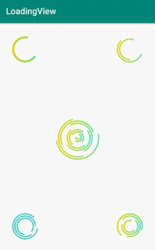

# LoadingView

[](https://raw.githubusercontent.com/jenly1314/LoadingView/master/app/release/app-release.apk)
[](https://jitpack.io/#jenly1314/LoadingView)
[](https://travis-ci.org/jenly1314/LoadingView)
[](https://android-arsenal.com/api?level=16)
[](https://opensource.org/licenses/mit-license.php)
[](https://jenly1314.github.io/)
[](http://shang.qq.com/wpa/qunwpa?idkey=8fcc6a2f88552ea44b1411582c94fd124f7bb3ec227e2a400dbbfaad3dc2f5ad)

LoadingView for Android 是一个圆弧加载过渡动画，圆弧个数，大小，弧度，渐变颜色，完全可配。

## Gif 展示



## LoadingView自定义属性说明（默认渐变色）
| 属性 | 值类型 | 默认值 | 说明 |
| :------| :------ | :------ | :------ |
| lvCount | dimension | 1 | 圆弧数量 |
| lvStartAngle | integer | 0 | 圆弧开始角度，默认三点钟方向 |
| lvSweepAngle | integer | 360 | 圆弧扫描角度范围 |
| lvStrokeWidth | dimension | 3dp | 笔画描边的宽度 |
| lvMaxSpeed | integer | 5 | 最大速度 |
| lvMinSpeed | integer | 3 | 最小速度 |
| lvCirclePadding | dimension | 2dp | 圆弧之间的间距 |
| lvRefreshInterval | integer | 15 | 刷新间隔时间，单位ms |
| lvColor | color | | 圆弧颜色,默认渐变色 |
| lvCounterclockwise | boolean | false | 是否逆时针方向旋转 |


## 引入

### Maven：
```maven
<dependency>
  <groupId>com.king.view</groupId>
  <artifactId>loadingview</artifactId>
  <version>1.0.0</version>
  <type>pom</type>
</dependency>
```
### Gradle:
```gradle
implementation 'com.king.view:loadingview:1.0.0'
```

### Lvy:
```lvy
<dependency org='com.king.view' name='loadingview' rev='1.0.0'>
  <artifact name='$AID' ext='pom'></artifact>
</dependency>
```

###### 如果Gradle出现compile失败的情况，可以在Project的build.gradle里面添加如下：（也可以使用上面的GitPack来complie）
```gradle
allprojects {
    repositories {
        maven { url 'https://dl.bintray.com/jenly/maven' }
    }
}
```

## 示例

布局示例
```Xml
    <com.king.view.load.LoadingView
        android:id="@+id/loadingView"
        android:layout_width="wrap_content"
        android:layout_height="wrap_content"/>
```

更多使用详情，请查看[app](app)中的源码使用示例

## 版本记录

#### v1.0.0：2019-8-9
*  LoadingView初始版本

## 赞赏
如果您喜欢LoadingView，或感觉LoadingView帮助到了您，可以点右上角“Star”支持一下，您的支持就是我的动力，谢谢 :smiley:<p>
您也可以扫描下面的二维码，请作者喝杯咖啡 :coffee:
    <div>
        
        
        
        
    </div>

## 关于我
   Name: <a title="关于作者" href="https://about.me/jenly1314" target="_blank">Jenly</a>

   Email: <a title="欢迎邮件与我交流" href="mailto:jenly1314@gmail.com" target="_blank">jenly1314#gmail.com</a> / <a title="给我发邮件" href="mailto:jenly1314@vip.qq.com" target="_blank">jenly1314#vip.qq.com</a>

   CSDN: <a title="CSDN博客" href="http://blog.csdn.net/jenly121" target="_blank">jenly121</a>

   博客园: <a title="博客园" href="https://www.cnblogs.com/jenly" target="_blank">jenly</a>

   Github: <a title="Github开源项目" href="https://github.com/jenly1314" target="_blank">jenly1314</a>

   加入QQ群: <a title="点击加入QQ群" href="http://shang.qq.com/wpa/qunwpa?idkey=8fcc6a2f88552ea44b1411582c94fd124f7bb3ec227e2a400dbbfaad3dc2f5ad" target="_blank">20867961</a>
   <div>
       
       
   </div>
